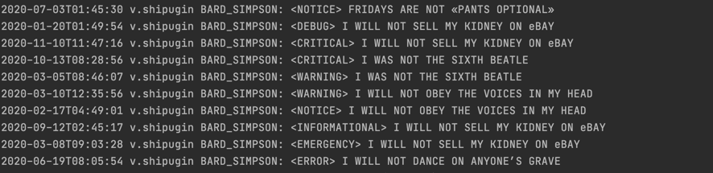

# Progress report

### Components Diagram

### Result of running Kafka in docker

### Result of successful generation of input data (syslogs)

### Result of successful build

### The result of starting and executing the program

#### The result of sending data to Kafka topic

#### The result of getting data from Kafka topic to ignite cache

#### The result of Ignite Compute computation

### Test run result

#### The result of running tests and building the project in CI.

