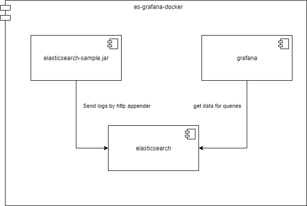
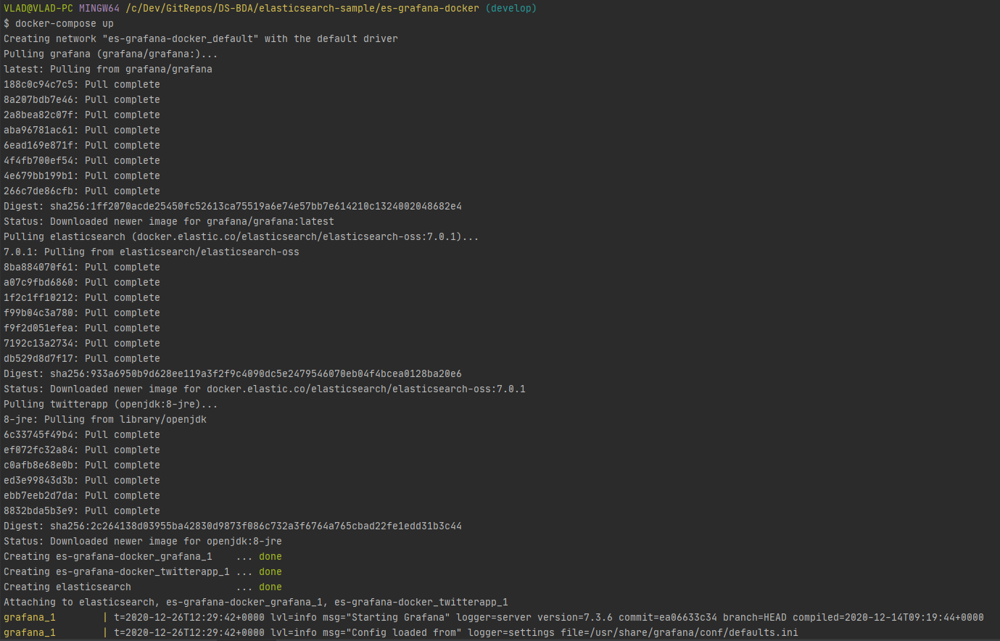
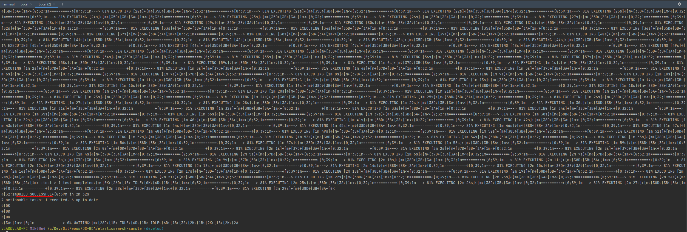
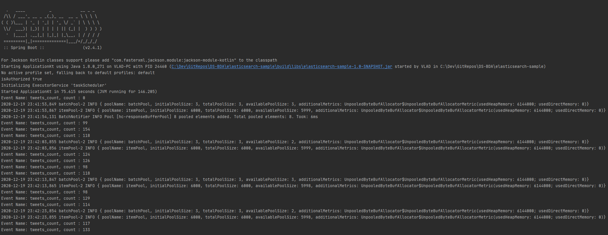
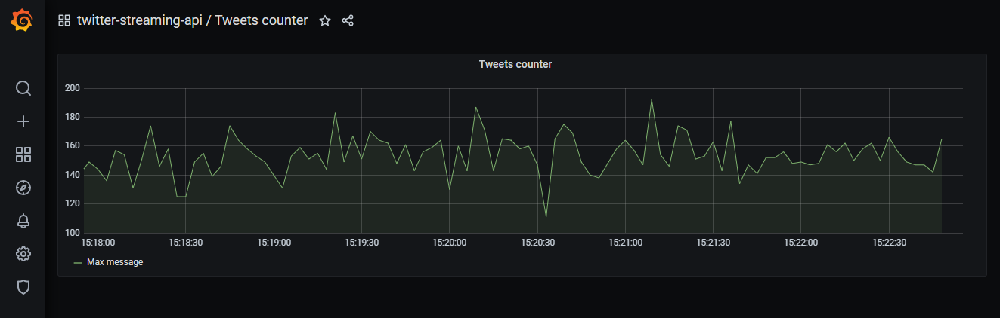
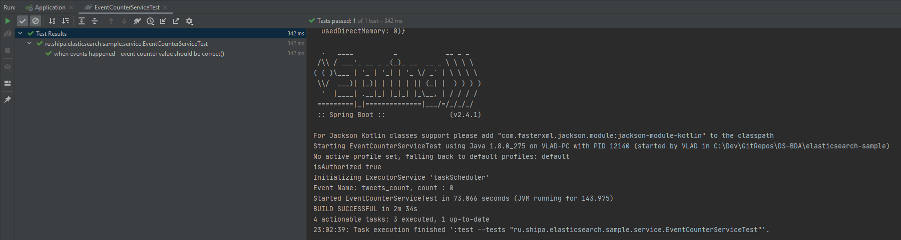
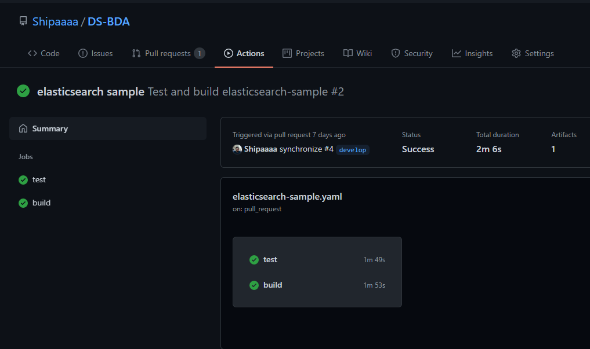

# Progress report

### Components Diagram

### Result of running elasticsearch and grafana in docker

### Result of successful build

### The result of starting and executing the program

### Test run result

