# Progress report

#### Result of running hdfs and yarn

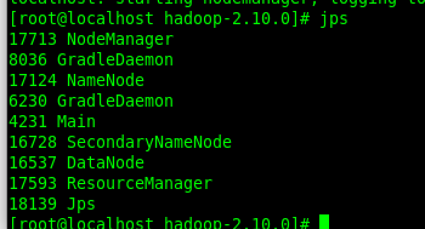

#### Result of successful generation of input data

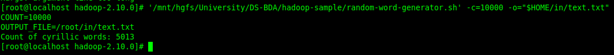

#### Result of loading output into hdfs

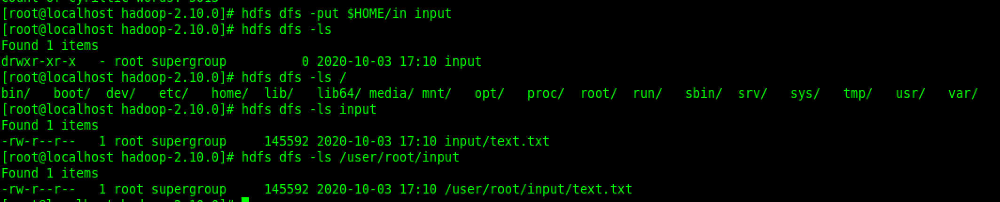

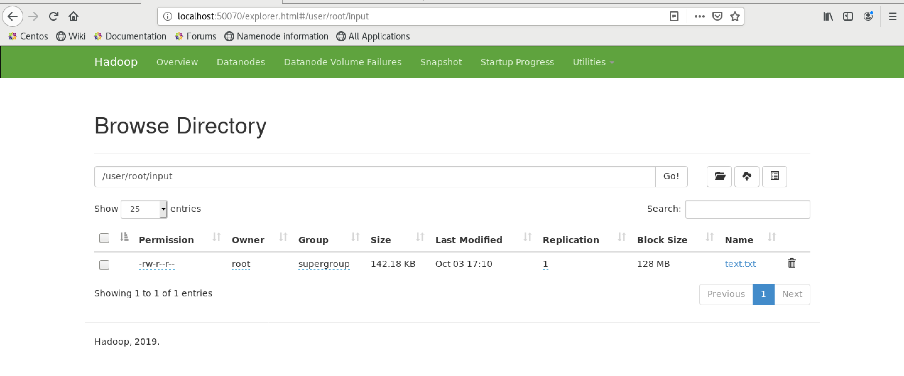

#### The result of starting and executing the program

##### Star

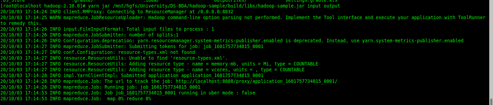

##### Logs

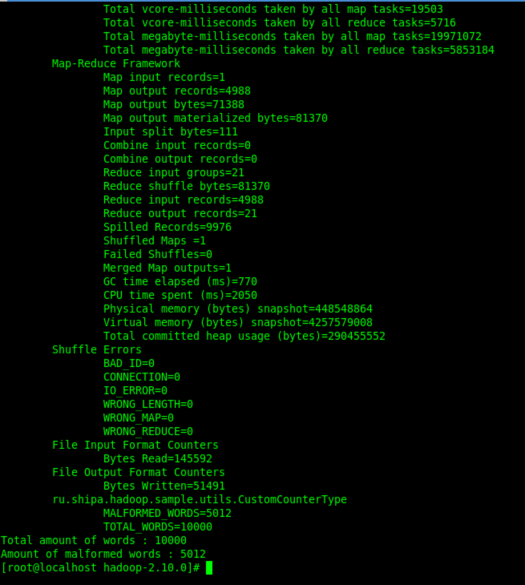

##### Counters

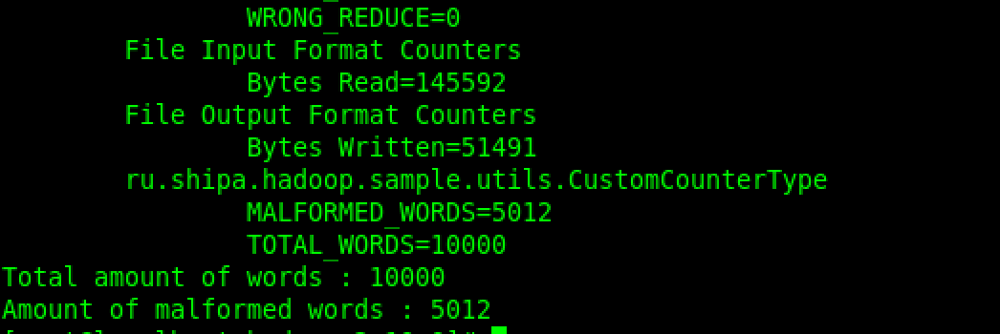

##### result

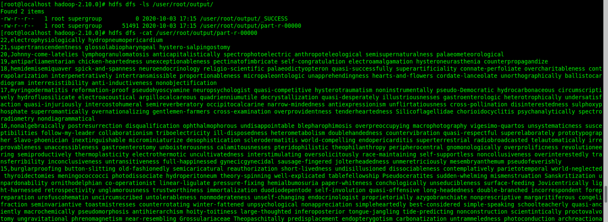

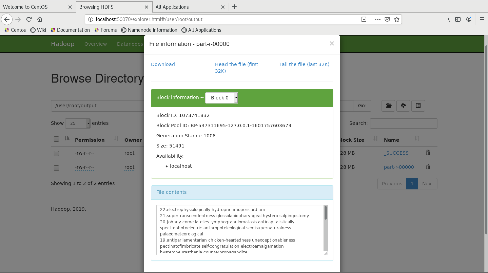

#### Test run result

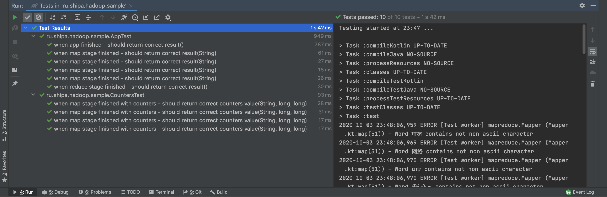

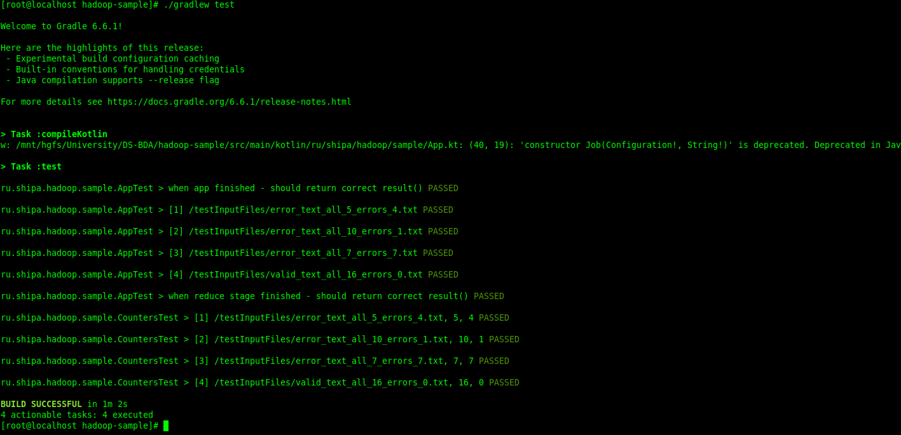

#### The result of running tests and building the project in CI.

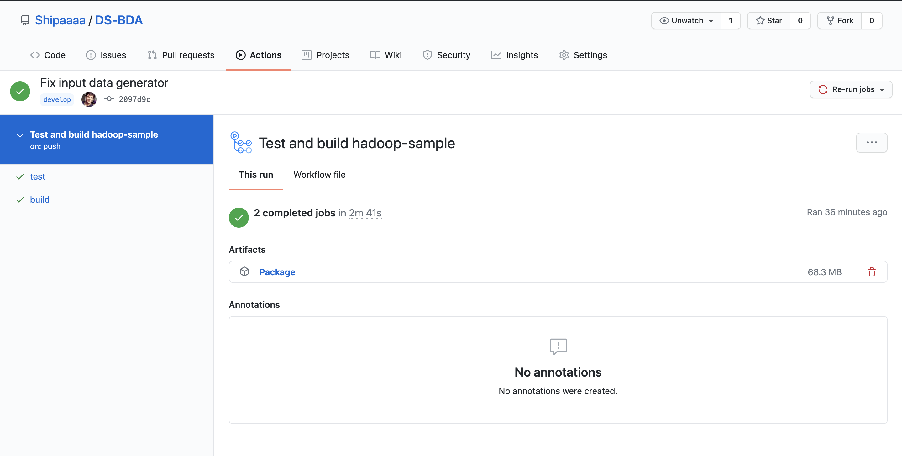